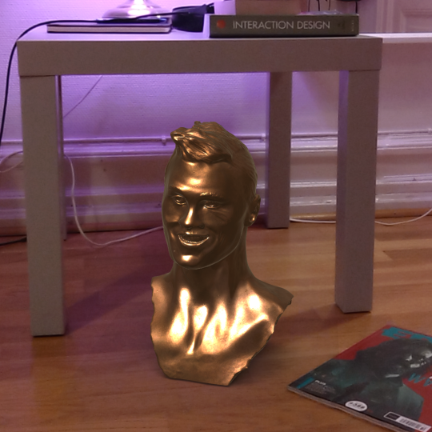
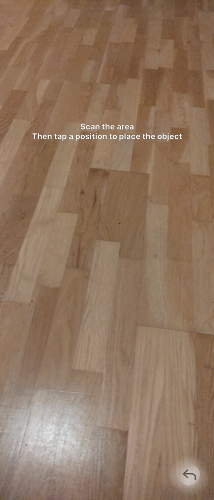

# HelloAR
Project conducted for course at Lund University

## Features
- Main menu that you can return to
- Object selection
- Hint on how to use the app upon selecting a mesh
- Plane occlusion (planes do require to be scanned prior to placing an object)
- Probe lighting based on the real environment
- Baked shadows to better ground objects on the scene

## Examples
### Menu

### Hint user
App hints uer to scan environment and then place the object with a tap.

### Scanning in progress
Detected planes can be visualized with a dot pattern

### Probe lighting
#### Purple-ish ambient lighting affecting object lighting

#### The same object on a more red-ish ambient light color

### Plane Occlusion
#### Object on the floor

#### Occluded by table

